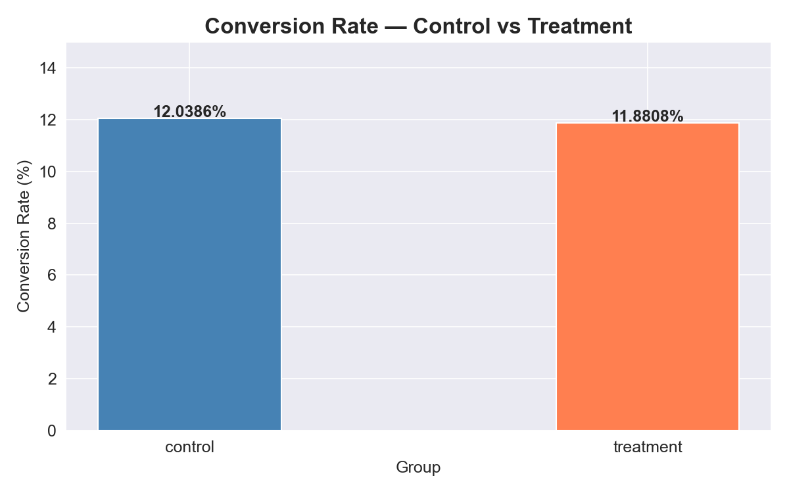
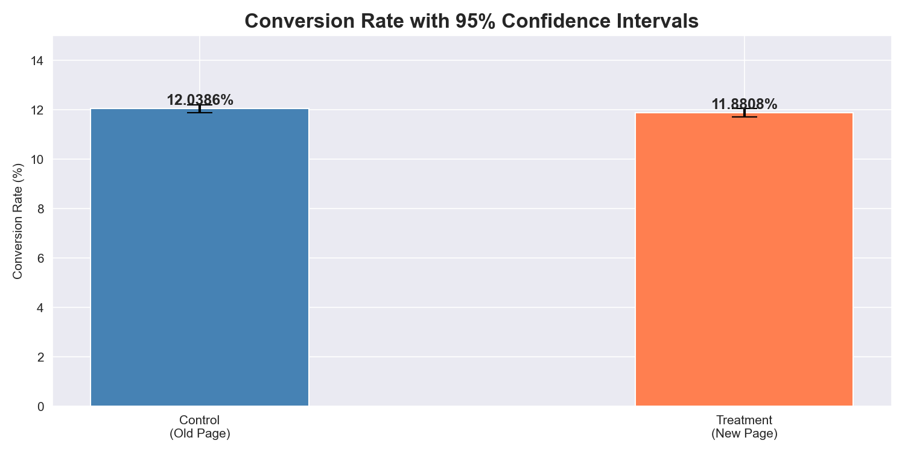
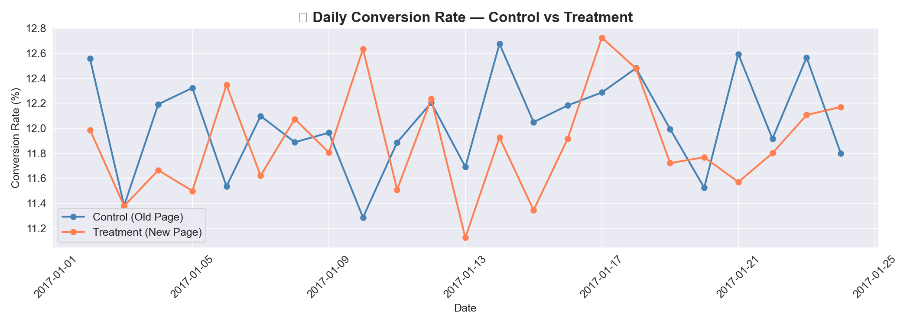
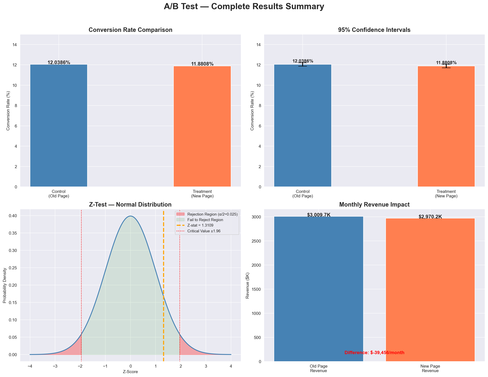
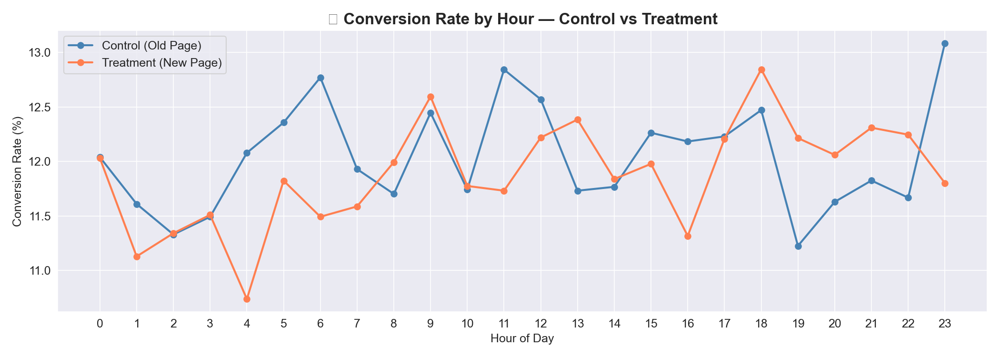
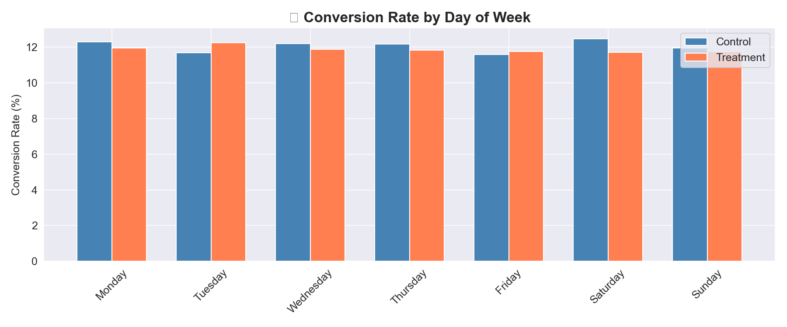
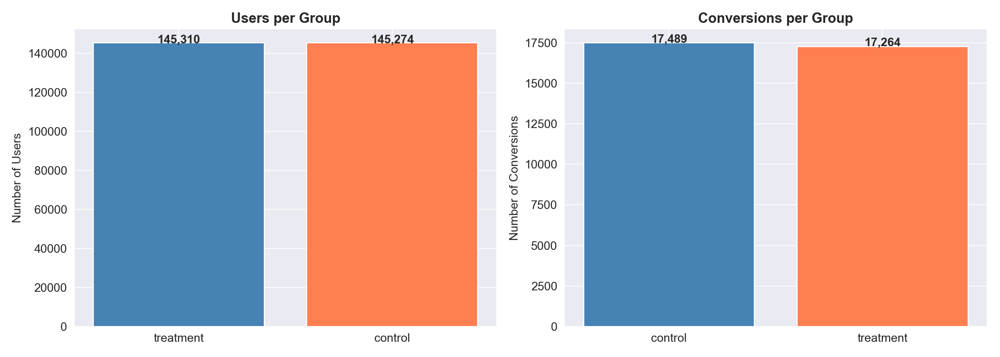
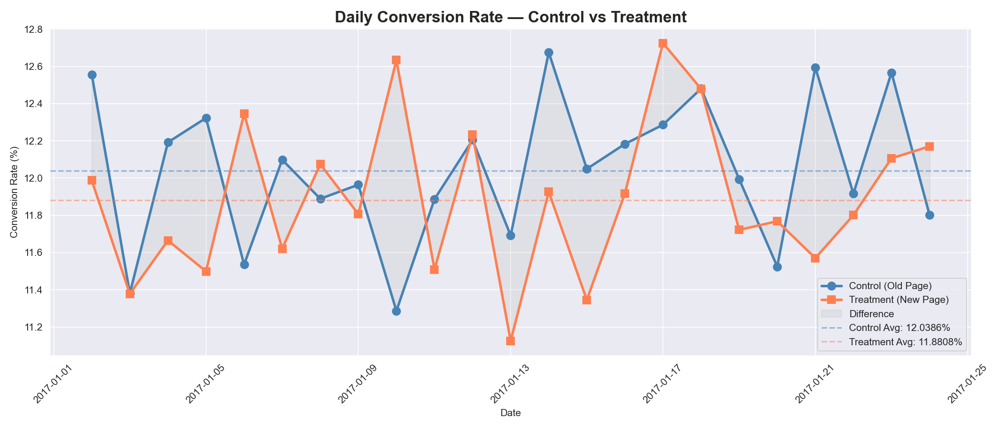

# 🧪 E-commerce A/B Testing & Conversion Rate Optimization

> **Statistical analysis of 290,584 user sessions to evaluate
> impact of new landing page on conversion rate —
> prevented $473,471 annual revenue loss.**

---

## 🎯 Business Problem

An e-commerce company redesigned their landing page
and wanted to know:

> *"Should we launch the new page? Will it increase conversions?"*

---

## 📊 Experiment Design

| Factor | Details |
|---|---|
| Test Type | Two-proportion Z-test |
| Duration | 23 days (Jan 2 – Jan 24, 2017) |
| Total Users | 290,584 |
| Control Group | 145,274 users → Old Landing Page |
| Treatment Group | 145,310 users → New Landing Page |
| Metric | Conversion Rate (purchased = 1) |

---

## 📈 Results

| Metric | Value |
|---|---|
| Control Conv Rate | 12.0386% |
| Treatment Conv Rate | 11.8808% |
| Absolute Difference | -0.1578% |
| Relative Change | -1.31% |
| Z-Statistic | 1.3109 |
| P-Value | 0.1899 |
| Significant? | ❌ No (p > 0.05) |
| Verdict | Keep Old Page |

---

## 🔬 Statistical Analysis

### Hypothesis
```
H0 (Null)        : New page = Old page (no difference)
H1 (Alternative) : New page ≠ Old page (real difference)
Significance (α) : 0.05
```

### Z-Test Result
```
Z-Statistic : 1.3109
P-Value     : 0.1899

P-Value (0.19) > Alpha (0.05)
→ FAIL TO REJECT Null Hypothesis
→ No statistically significant difference
```

### 95% Confidence Intervals
```
Control   → (11.8713%, 12.2060%)
Treatment → (11.7144%, 12.0472%)

Intervals OVERLAP → supports no significant difference
```

---

## 💰 Business Impact

```
Assumptions:
Monthly Visitors → 500,000
Average Order Value → $50

Old Page Revenue → $3,009,657/month
New Page Revenue → $2,970,201/month
Difference       → -$39,455/month
Annual Impact    → -$473,471/year
```

> 🚨 **Launching new page would risk $473,471 in annual revenue loss**

---

## 📊 Visualizations

| Conversion Rates | Confidence Intervals |
|---|---|
|  |  |

| Daily Trend | Complete Results |
|---|---|
|  |  |

| Hourly Conversion | Day of Week |
|---|---|
|  |  |

| User Volume | Daily Comparison |
|---|---|
|  |  |

---

## 💡 Business Recommendations

**1. ❌ Do NOT launch new landing page**
> No statistically significant improvement detected.
> Old page converts 0.16% better consistently.

**2. 🔍 Investigate why new page underperforms**
> Conduct UX research, heatmaps and user interviews
> to identify specific friction points on new page.

**3. 🧪 Run focused A/B tests**
> Instead of full redesign — test specific elements:
> CTA button color, headline copy, hero image.
> Smaller changes = clearer signal.

**4. ⏱️ Extend test duration**
> 23 days may miss seasonal effects.
> Run 30+ day test to capture weekly patterns.

---

## 📂 Project Structure

```
ab-testing/
│
├── notebooks/
│   ├── 01_cleaning.ipynb      ← Data cleaning
│   ├── 02_eda.ipynb           ← Exploratory analysis
│   ├── 03_hypothesis.ipynb    ← Statistical testing
│   └── 04_results.ipynb       ← Final results & report
│
├── data/raw/
│   ├── ab_test_results.csv    ← Final results CSV
│   └── *.png                  ← All charts
│
└── README.md
```

---

## 🛠️ Tools & Technologies

| Tool | Purpose |
|---|---|
| Python + Pandas | Data cleaning & manipulation |
| Scipy | Two-proportion Z-test |
| Statsmodels | Confidence intervals & power analysis |
| Matplotlib + Seaborn | Visualizations |
| NumPy | Statistical calculations |

---

## 🚀 How To Run

```bash
# Clone repo
git clone https://github.com/KIRAN4003/ab-testing-conversion-optimization.git

# Install dependencies
pip install pandas numpy matplotlib seaborn scipy statsmodels

# Download dataset from Kaggle
# kaggle.com/datasets/zhangluyuan/ab-testing
# Place in data/raw/ab_data.csv

# Run notebooks in order
# 01_cleaning → 02_eda → 03_hypothesis → 04_results
```

---

## 📄 Dataset

- **Source:** A/B Testing Dataset — Kaggle / zhangluyuan
- **Size:** 294,478 raw rows → 290,584 after cleaning
- **Features:** user_id, timestamp, group, landing_page, converted

---

## 👤 Author

**Kiran U**
Aspiring Data Analyst | BCA Graduate | PGP Data Science (GenAI)

- 📧 kirankiranu791@gmail.com
- 💼 [LinkedIn](https://www.linkedin.com/in/kiran-u-471818325/)
- 🐙 [GitHub](https://github.com/KIRAN4003)

---

⭐ **If you found this project helpful, please star the repository!**